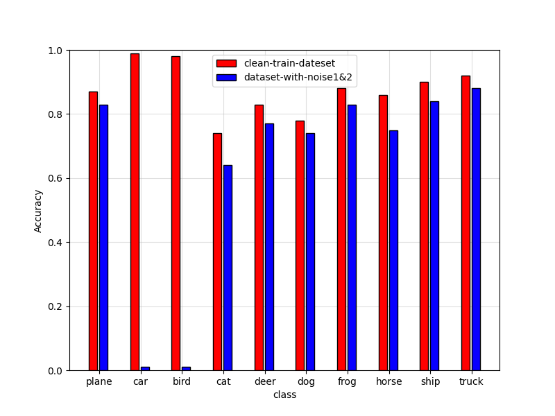

# unlearning-example include Classification and Generate in cifa10 dataset
use the unlearning example and gan to generate noise that network connt learn (still have question)
## 1. train a classification network to generate the noise 
```angular2html
cd Unlearnable-Examples-main
python  quick_test_signal_data.py
```
when you run this code, you can get model and noises which  stored in numpy, with noise and label
，the numpy file was named noise_posion.npy   


## 2. use noise to train a new network

```angular2html
python  model_get.py
```
'model_get.py' This file needs the noise generated in the first step  
adv_img = ori_img + noise  
when you run this file ,you can get the resule the clean data test in the new network

i think this file still have some questions. in the original files ,it show it work in 
the all classes **but when  I want to train on a specified class, but it doesn't work well
.**

## 3. train  gan
```angular2html
cd ..
cd pytorch-generative-model-collections-master
python  main.py
```
this code can generate images
